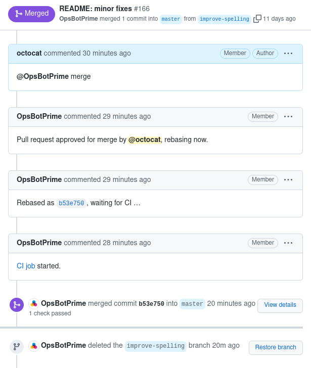
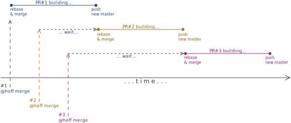
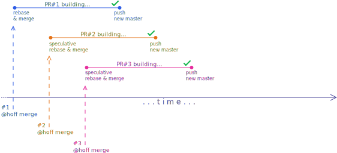
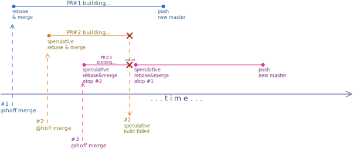
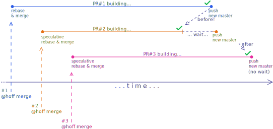
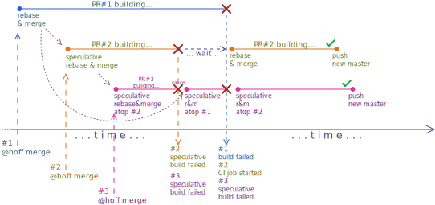
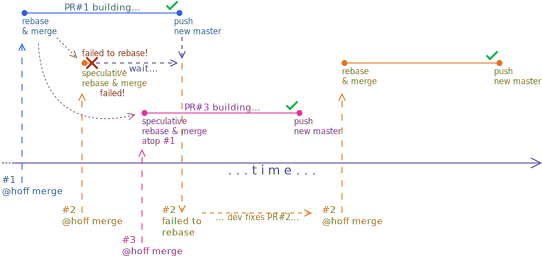
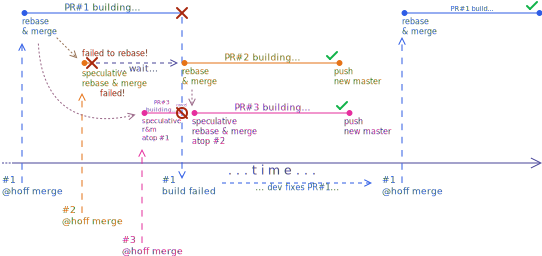

# Hoff

Hoff is a bot for GitHub that enforces a clean history, and ensures that master
always builds.

Hoff intends to replace the merge button in the GitHub UI.  Hoff integrates
changes into master using a *rebase*. This keeps the history clean, free of
random fork points and merge commits.  (TODO: In the future Hoff will also
enforce a commit message format.)

Furthermore, Hoff implements the [Not Rocket Science Principle][not-rocket-science]
of software engineering:

> Automatically maintain a repository of code that always passes all the tests.

The application watches a repository for new pull requests. Once a pull request
has been approved (through an `@hoffbot merge` comment left by the PR author or
reviewer), it integrates the changes into master, and pushes those to a testing
branch. When CI reports a successful build for this branch, master is forwarded
to it. If the build fails, the commits never make it into master, keeping the
build green at all times.

Merge trains: if a second PR receives a merge comment while a build is still
happening, Hoff starts a speculative rebase on top of the previous build.  The
same goes for a third PR.  Assuming all of the three builds pass, the third PR
is merged after the time of a single build.

## Using Hoff

Supposing Hoff is set up to listen for the comment prefix `@hoffbot` with a
matching GitHub user, you use it by commenting on a PR with any of the
following commands:

* `@hoffbot merge`: rebase then merge;
* `@hoffbot merge and tag`: rebase, merge then tag.
* `@hoffbot merge and deploy`: rebase, merge, tag then deploy;

For all the commands, Hoff will wait for the builds to pass after rebasing and
before merging.  When the PR is merged, GitHub closes the PR as merged and,
when configured to automatically do so, deletes the PR branch.

Hoff does not actually do the deploying.  It just adds a special marker to the
tag message indicating to the CI job that the tag should be deployed.

On Fridays, by default, Hoff refuses to do the above actions.  To force merges
on Fridays, simply add `on friday` at the end of your commands, like so:

* `@hoffbot merge on friday`;
* `@hoffbot merge and tag on friday`.
* `@hoffbot merge and deploy on friday`;

## Installing

See the [installation guide](doc/installing.md) if you want to run a self-hosted
version of Hoff.

TODO: Write a proper guide to build a package.
TODO: Publish official deb packages?

## Building

Hoff is written in Haskell and builds with [Stack][stack]:

    $ stack setup
    $ stack build
    $ stack test

## Running as a developer

To run the application locally
you first need to create an appropriate `config.json` file:

    $ cp doc/example-dev-config.json config.json

Edit `config.json` to match your required settings.
You can generate a personal access token in the
["personal access tokens" tab of GitHub settings](https://github.com/settings/tokens).
Give it a 7 days expiration and access to just "repo"s.

    $ mkdir -p run/state
    $ stack exec hoff config.json

If using Nix, you may get a `ssh: command not found` error
-- just pass `--no-nix-pure` to `stack exec` to avoid it:

    $ nix run -c stack exec hoff config.json --no-nix-pure

You can then access [http://localhost:1979](http://localhost:1979)
to see the open PRs and build queue.

The build queue is fetched through GitHub's web interface,
so you will be able to see the full list right away.

[Comment]s and [build status]es are only sent in though a webhook.
While running without a public IP address,
GitHub will have no way of notifying your Hoff instance.
You can use some of the scripts in the `tools/` folder
to simulate those:

    $ ./tools/comment deckard 31337 @hoffbot merge

	$ ./tools/build-status c033170123456789abcdef0123456789abcdef01

[Comment]: https://docs.github.com/en/developers/webhooks-and-events/webhooks/webhook-events-and-payloads#issue_comment
[build status]: https://docs.github.com/en/developers/webhooks-and-events/webhooks/webhook-events-and-payloads#status

The tests of Hoff are extensive, you may be able to get by just by running them
when making changes to the code.  To run a specific test, use `--match` giving
part of the test title:

	$ nix run -c stack test --ta '--match "part of the test title"'

The implementation uses free monads and some of the tests replace lower level
functionality with mocks.

## Running on a server

To run Hoff on a server, you can build a self-contained squashfs file system
image with [Nix][nix]:

    $ nix build --out-link hoff.img
    $ cp package/example-config.json config.json
    $ vi config.json # edit the file appropriately
    $ sudo systemd-nspawn \
      --ephemeral         \
      --image hoff.img    \
      --bind-ro=$PWD:/etc \
      -- /usr/bin/hoff /etc/config.json

The image includes Hoff and all of its dependencies (Git, SSH). You can run it
with systemd. TODO: Make it work with portablectl.

You can also build Hoff as a deb package by running:
`./package/build-and-ship.sh`

## Features

### Comment interface

The main Hoff interface is through GitHub comments,
here is [an example](https://github.com/channable/hoff/pull/166):

Channable's Hoff repository is tracked itself using Hoff ([@OpsBotPrime]),
so you can see many examples of use in past merged PRs
([#173], [#167], [#138], [#108], ...).

[#173]: https://github.com/channable/hoff/pull/173
[#167]: https://github.com/channable/hoff/pull/167
[#138]: https://github.com/channable/hoff/pull/138
[#108]: https://github.com/channable/hoff/pull/108

### Web interface

In addition to the comment interface, you can check the status of running and
failed builds through a web interface:

TODO: add image: ... break then fix build...

### Merge trains

Hoff supports parallel speculative builds of subsequently approved PRs.
Without merge trains, here is how a timeline of interaction with Hoff
would go:

Supposing the build time is of ≈10 minutes:

* the authors of PR#1 wait ≈10 minutes for their PR to be merged;
* the authors of PR#2 wait ≈16 minutes for their PR to be merged;
* the authors of PR#3 wait **≈22 minutes** for their PR to be merged.

With merge trains, we reduce the waiting time for merges.
Here is the same timeline of interaction for Hoff with merge trains active:

The first PR is merged and rebased immediatelly as usual.
The second and third PRs are now merged and rebased immediatelly
on top of the first and second respectively.
Assuming all builds eventually pass,
the authors of all PRs only have to wait 10 minutes each.
The waiting time for authors of the third PR is _reduced by 12 minutes_!

**Failing merge trains.**
If at some point in the train a build fails, subsequent PRs are (speculatively)
reintegrated and their builds are restarted:

1. Three merge commands are issued in a short period for PR#1, PR#2 and PR#3.

2. PR#2 fails while PR#1 and PR#3 are still building.
    1. Since PR#2 is built on top of PR#1,
       we cannot assume it is the culprit of the failure
       so we delay reporting this until PR#1 finishes.
    2. Since PR#3 has been built on top of PR#2,
       its build is restarted with a rebase and merge on top of PR#1.
       This is done by pushing to the `testing/2` branch.

3. PR#1 build passes, `testing/1` is pushed (promoted) to be the new master.
   The speculative failure of PR#2 is now real so this is reported.

4. PR#3 build passes, `testing/3` is pushed (promoted) to be the new master.

5. At this point, the authors of PR#1 have fixed their PR
   and issue a new merge command.  Hoff carries on as usual.

When PRs are closed or receive a new commit,
the behaviour is similar to a build failing
with the only difference being the comment posted by Hoff.

**Builds started later finishing earlier.**
Builds results do not always come in the same order
as they were started in the train.
When the build result of a later PR
arrives before the result of an earlier PR
we wait before merging:

**Complex scenario.**
Here is a more complex scenario involving builds arriving in the unexpected order
and failures:

**Rebase failures.**
When we fail to rebase a branch in a train,
we do not know whether this is a conflict with `master`
or any other PRs in the train.
We have to wait for the build results of the last PR it is based on
before doing anything.

If the build eventually passes for the parent PR,
Hoff reports a rebase failure as the parent PR has become the new `master`:

If the build eventually fails for the parent PR,
Hoff does a new rebase and merge:

## Further reading

More information is available in the doc directory:

 * [Background](doc/background.md): My original intention was more ambitious
   than building a GitHub bot. This document gives some background about what I
   want to build.
 * [Installing](doc/installing.md): The installation guide.

## License

Hoff is free software. It is licensed under the [Apache 2.0][apache2] license.
It may be used both for commercial and non-commercial use under the conditions
given in the license.

[not-rocket-science]: https://graydon2.dreamwidth.org/1597.html
[stack]:              https://haskellstack.org
[nix]:                https://nixos.org/nix/
[apache2]:            https://www.apache.org/licenses/LICENSE-2.0
[GitHub webhook for the build status]: https://docs.github.com/en/developers/webhooks-and-events/webhooks/webhook-events-and-payloads#status
[faf04c9]:            https://github.com/channable/hoff/commit/faf04c96486cb9dc30b6f133f6574ceab3401955
[@OpsBotPrime]:       https://github.com/OpsBotPrime
